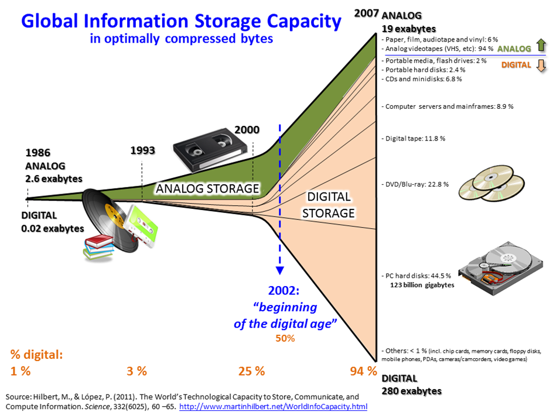
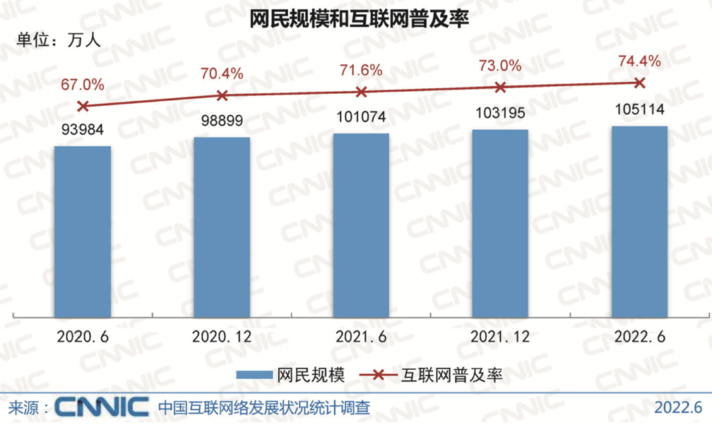
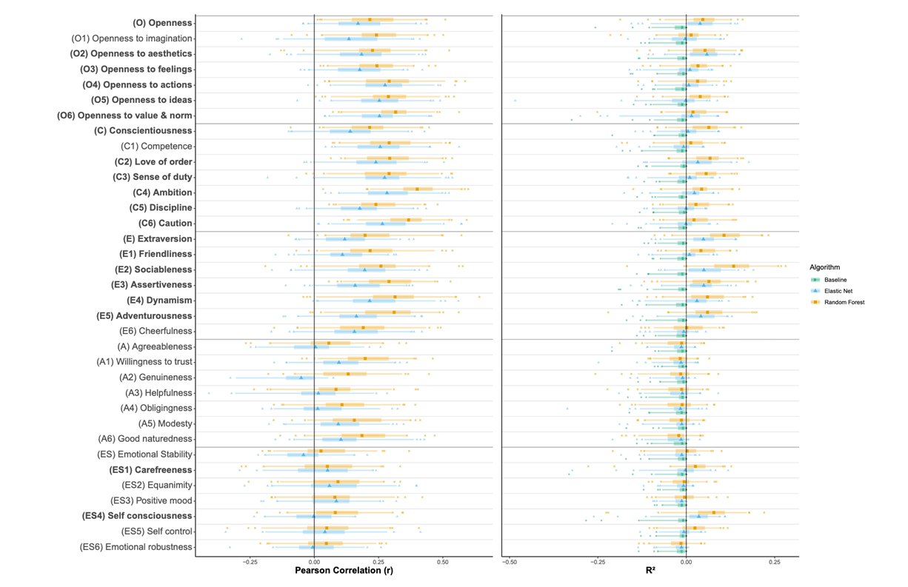
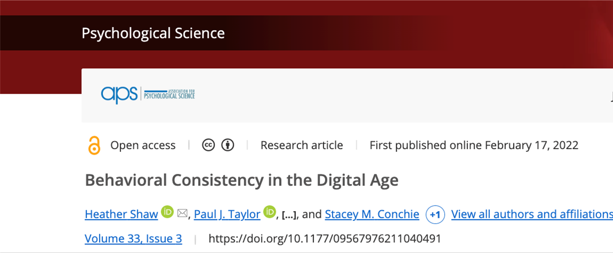
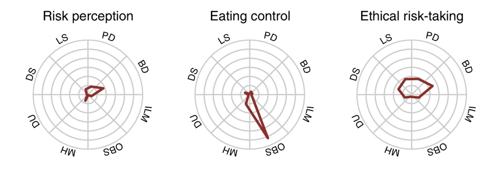
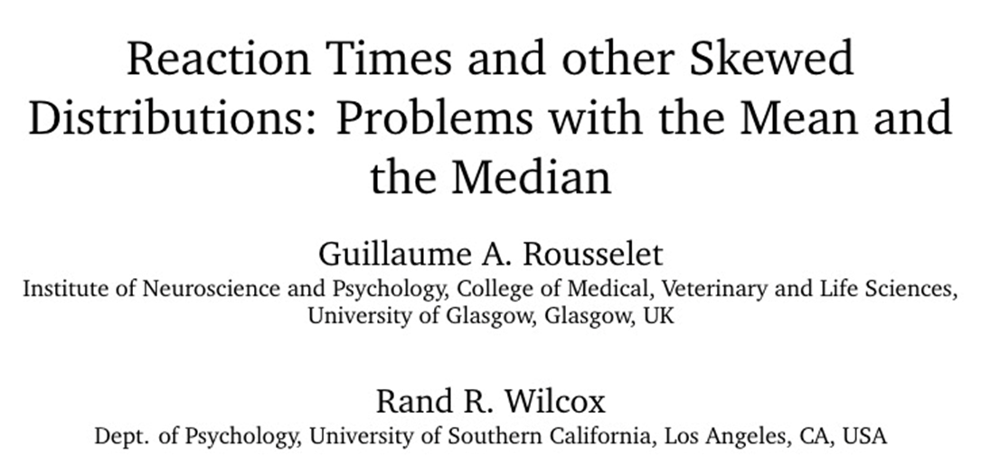
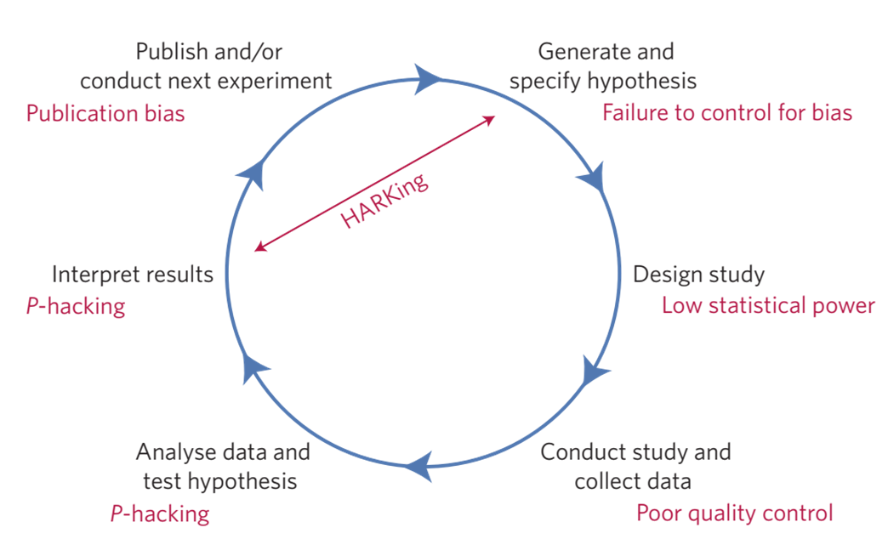

# 第一讲：为什么要学习R {#lesson-1}

**序**

第一节课的主要目的在于帮助大家初步了解本课程，并为本课程做好心理准备。所以接下来，我们主要介绍为什么要开设这门课程、课程的内容是什么、需要做什么样的准备、以及能收获什么。

## R在心理科学及社会科学中的运用

### 数据科学 {#1-data-science}

开设这门课有其时代的大背景。作为在心理学院讲授的课程，我们将本课称为《R语言在心理学研究当中的应用》。但实际上，R语言是当前数据科学（data science）中主流的计算机语言之一。 正是数据科学在各种学科中的渗透和普及，让我们开设这门课程成显得非常重要。那么什么是data science呢？

**数据科学是什么**？ 

在科学研究中有人认为，科学的革命是经过了几次范式转换的（[参考链接](https://www.perfcloud.cn/blog/post/81)）。最早期的是"实验"科学，我们通过做实验，一个一个地去验证假设。随后是理论科学，在实验基础上进行归纳。随着计算机越来越发达，我们进入了"计算"时代，通过用各种计算模型模拟的方法，帮助我们去理解世界。但是现在，随着数据越来越多，通过数据驱动的方式就能发现很多新的东西。最近这些年，很多在科技领域尤其是在计算机领域取得的重大突破和进展都是依赖于大量数据的，也就是通过对数据进行“提炼”从而得到新的发现。比方说最近非常火的ChatGPT。作为现在全球最火的科技界产品之一，它背后的模型叫做LLM，Large Language Model。这里说的Large language就是一个大语言模型，它依靠的就是大量语言材料的训练。

**数据科学的内容**

大概10多年前，数据科学就已经出现。这两年大家应该对“数据科学”已经不再陌生。数据科学里面既涉及到计算机编程，也包括数理统计。当讨论具体应用领域的数据科学，比如心理学的科研领域，数据科学也需要domain-specific 的知识，也就是这个领域的特殊性知识。

这意味着什么？意味着如果你仅仅懂计算机，那你不一定能懂data science的；如果你仅仅是懂数学和统计，那也不意味这你能解决一个data science的问题。必须要将计算、统计和领域特殊的知识进行结合。在心理学研究中，这对研究生提出一个新的要求。

### 数据科学的诞生------数字化时代 {#1-data-science-born}

为什么会有data
science？其实大家应该能感受到，随着我们电脑的普及，互联网越来越发达，我们产生的数据实际上产生了爆炸式的增长。这里有一个可视化的例子。我们可以看到，在计算机出现之前人类产生的数据是非常少的，而计算机出现之后产生的数据越来越多。

我们也有了越来越先进的仪器，它们所观察到的、产生的数据也是非常大的。去年的这个图片相信很多人在朋友圈都被刷屏过。这是人类所能观察到的一个划时代的新的图像，尽管我们可能不知道它具体的内涵是什么，但是都知道它很酷。

此外，我们国家是互联网普及最高的国家之一，我们现在有百分之七十四（可能现在又更多了）的人都已经开始接入到互联网。这么多的人接入到互联网，所产生的数据可想而知，一定是海量的。所以现在我们很多电商，像淘宝这样的各类购物平台，它们在中国做的是非常好的，这也得益于海量的数据。包括最近像拼多多，听说在美国也是势如破竹，态势很猛。还有像TikTok，就是字节跳动，前一段时间在美国甚至被封杀了，为什么它被封杀了，因为大家都很喜欢他。就比如中国的这个字节跳动，它有一个特点就是它很好地利用了中国大量的网民产生的海量数据，通过网民不断地使用它们的产品，不断地进行迭代。所以当它能出海的时候，去给海外的用户提供服务的时候，它的迭代已经非常成熟了。当然迭代的过程中需要大量数据的产生和调试，产品才能越来越成熟。

**数字化对心理学研究的影响**

其实很早就有人关注数字化我们心理学的影响了，国内的研究者也经常会提到心理学和大数据。我们这里做一个不完全的概括，主要是这三个方面的显著变化。

**Big n (sample size)**

首先就是样本量很大。现在的数字化平台生产的数据非常大。我们传统的行为学实验可能就是几十、几百的数据，上千已经是很不错的了，上万就比较费劲了。但是如果说我们能从互联网上抓取数据的话，那动辄就是上万甚至是百万级别的。

**Big v (variables)**

不仅仅是样本的体量更大，也意味着收集到的变量更多了。比如我们使用手机，那其实我们产生了非常多的数据。你一天使用多久、点击多少次、点击了什么、在哪个地方、用的是什么APP，甚至包括你所处的地址，你在地球上的经纬度、当地的气温、湿度这些数据信息。如果大家还记得的话，有一有段时间有一个非常火的一个图片。显示的是美国陆军还是海军运动的一个轨迹。因为他们使用了一个运动的APP。大家就可以看到他们在在哪跑步在哪个健身房健身，然后去哪活动等等非常的详细的地理的资料。当然这是属于一个看起来很好玩的东西。那么能不能够用于心理学的研究呢？几年前，北大的王连老师和我们心理学院的韦文琦老师在human
behavior上面发了一篇论文就是讲不同的地区跟人格之间的关系。所以实际上就是我们能够产生很多的数据，这些数据能进行大量的挖掘，这些挖掘可能是以前你没法想象的。

**Big t (time)**

还有就是时间的跨度比较长。现在很多的APP一旦用户开始使用之后就会长期使用，如果能用于收集心理学的数据，就可以在很长的一段时间里记录很多的数据。这对于了解人类的心理和行为的规律来说其实是非常好的。对于发展心理学家来说，有这样的一个例子：有一个做语言发展的一个研究者他从自己的孩子出生开始就一直用视频记录孩子的成长。儿童产生语言目前对于人类来说还是一个不能够完全理解的过程，从语言学上看这是一个很大的跳跃。这位研究者完全记录了孩子生长的过程，积累了大量的数据，并通过对视频数据的全方位分析，得到了以前心理语言学比较少能够得到的东西。

**数字化时代的心理学研究**

这里有几个例子。比如这个是利用手机里的数据预测人格，我们这里看到的纵轴就是人格的类型，不同的颜色表示使用不同的方法进行预测，横轴是相关系数。可以发现说手机里的一些数据和人格的倾向是密切相关的。

另外，像我们心理学的顶刊Psychological
Science，上面也不定期的有研究是探索我们在数字的视觉中留下的痕迹跟我们的行为之间的关系。比如这篇文章发现我们个体在使用手机的行为上是非常的一致的。研究者通过大量的数据是得到了一个比较强的一个结论，尽管这个结论比较简单，但是基于数据量比较大，说服力是比较强的。

我们也可以利用互联网的平台来收集行为的数据。传统上我们是把被试带到实验室做实验，但现在由于互联网的发达，我们可以进行线上实验。在疫情期间，不少同学可能尝试过JsPsych或者巴普洛夫这样的平台，把实验编写好放在网上，并通过链接给被试发放被试费。这样我们在短时间内可以收到比传统实验室更大量的数据。同时，因为我们使用的其实还是传统的实验任务，只要事先验证过在线的实验和实验室实验的可比性，就可以利用互联网在线去收集更大量的数据来研究我们感兴趣的问题。

比如这里列举的实验，去年的R课上我们以此作为了示例。它就是通过在线的平台收集的数据，收集到了很多变量。它的研究一个目的是为了探测self
regulation，自我控制或者硕士自我调节，不同的测量方法是不是一致的，哪一个能更好地预测生活中的一些行为，比方说这里就是看哪一些与饮食控制有更强的相关。

**数字化时代心理学研究方式的变化**

数字化时代不仅给心理学提供了新的数据，实际上也变革了我们做研究的方式。比如说合作。在疫情以前，研究者建立国际合作主要是通过导师的联系、邀请讲座或者是开会时建立联系。但在疫情期间，因为大家都困在家里同时又都使用很发达的互联网，所以就有研究者直接在社交媒体上发起合作的倡议。比如有的人说我有个想法需要在不同国家收数据，想要有人和我一起收集数据，最后可以一起发表文章。在疫情期间很多研究就是这么展开的，并且因为这样的研究往往样本量比较大，也能发到很好的期刊上去。同时，除了个人的发起，研究者们也成立了更多的学术组织，比方说Psychological
Science
accelerator心理科学加速器，这个组织就是专门组织在全球范围通过互联网进行合作研究。

此外，以前研究者需要去线下开会或者是参加工作坊，现在即便是疫情过去了，大家还是越来越习惯和更多地采用在线的方式进行学术讲座或是工作坊。所以呢互联网实际上是改变了我们心理学的方方面面。

### 为什么要学习R语言？{1-why-learn-R}

我个人总结了一些我们学习R语言或者说学习R而不是matlab或者python的理由。

首先是一个大的背景。R语言是一个开源的一个软件，他跟python、junior一样，基本绝大部分的基于R语言的工具都是开源的免费的，也说你基本上都能够（只要你的互联网是畅通的话）免费得到所有的内容。

第二，它是一个高级的语言，不需要和计算机的硬件直接进行交流，和我们日常的语言差不多。

第三，它有一个强大的community。因为现在的所有的开源的语言，他依赖于有多少人在使用它、有多少人在不断的进行开发、尤其是谁在开发这些新的东西。对于我们心理学或者是社会科学而言，绝大部分是使用R做数据分析。简单来讲，我们一开始作为新手肯定不会去开发什么工具的，就必须要把别人开发的工具拿过来。那谁为我们开发呢？肯定是这个community里的人，这就需要我们有一个比较成熟和强大的社区。而R语言本身就是由统计学家所开发的，所以它就是为了做数据分析而生的一门语言。同时，在这么多年的发展当中有大量的研究者，尤其是社会科学的研究者不断加入这个community，从初学者变成使用者最后变成开发者。

从做研究的角度来说，R可以在这三个方面提供强大的支持。

**科学性**

它有助于增强计算的可重复性，帮助我们找到更加适合的新的统计的方法。

**美观**

它可以帮我们得到非常好的图片，有非常精细的图片的细节控制。

**实用性**

它可以适用于我们做研究的各个阶段，也能够适应这个数字化时代的需求，比如大数据的需求。

#### 心理学的可重复性危机

在我们心理学领域从2011年开始出现了一个比较大的问题，就是可重复性的问题。大量发表的研究的结果无法被其他的研究者独立重复。那这个问题到底有多严重呢？最有代表性的应该就是这篇文章。在2015年的时候，一篇Science的文章专门报道了整个心理学领域的可重复性的问题。Science是跨领域的多学科的一个综合的期刊，能够发表到Science这个期刊的文章都是能够引起广泛的兴趣的，也是对整个科学界来说都很重要的。在这个文章中当中100个团队重复了2008年发表在心理学顶刊上的100个研究。他们的分析的发现大概只有36%的结果是能够被重复出来的。2015年这个结果是引起了非常大的震撼也被nature评价为2015年的年度的十大重要的论文之一。因为这个问题出现，研究者就做了很多的反思。当然我也是被这个问题所深深的震撼，现在还是在一直在寻求能够去做到更加严谨、可重复的透明的这种研究。这个是我在2016年的时候跟我们课题组的同学一起写的一篇对可重复性问题的一个介绍和思考，大家有兴趣的话可以看一下。

我这里没有去把这些心理学的计算上可重复的研究拿过来，有人对心理科学在science这个期刊上面有公开数据的文章进行了计算的可重复性的检验，也就是说按照研究者描述的方法去做一遍分析，看能不能得到跟研究者一模一样的结果。大家猜一下这个比例大概有多高。做一个区间吧30%以下、30%到50%、50%到80%、还是80%到百分之百。约为30%以下的举手，30%-50%呢，50%到80%呢。大家都很乐观啊，80%我就不问了吧。如果说我们考虑完全能够重复的话，他们在14篇文章里面只有1篇能够重复，是1篇还是2篇能够完全重复。然后有的是在作者的协助之下都得不到原来的结果，所以这个问题并没有那么简单。

#### 利用R语言增强计算的可重复性

既然他是这么大的一个问题，那么为什么说r语言可以帮助我们解决计算的可重复性呢？首先是说可重复性它是有多个层面的。大家可以可以想一下，如果说你的这个结果是可以重复的，那么最简单的一个可重复是什么？就是计算的可输入性对吧。computational
reproducibility，这个computation
reproducibility说的是什么？假如你有一个数据，然后你做了一套分析，你把它报告出来了，我拿到你这个数据，我按照你描述的方法，我能不能得到跟你一模一样的结果。假如说你的计算的过程当中，没有一些随机的生成的过程，全部都是说我们用的这种可以求到解析解的这种这种算法的话，那就意味着我不仅仅要跟你的结论是一致的，而且是在数值上应该是一模一样的。你原来得到比方说t等于2.1，那我应该也得到就是t等于2.1，或者你得到的是f等于
10，我应该也得到f值等于10，不然就说明什么计算上他是他是不可重复的。

##### **记录数据分析的全过程**

你们现在可能绝大部分是研一的同学，那么你们自己有做过数据分析吗？有的举手做过数据分析吗？就是你们做毕业论文应该做过数据分析吧，都不举手，没有做过毕业论文？做个数据分析大家都是用的什么软件，SPSS？那你们都要通过手点击吧，你们现在还记得怎么点击的吗，一步一步的怎么点击过来的。

所以我们实际上按照传统的做数据分析的方法，我们都是用手动的去点击对吧，尤其是前面那一部分。我们不是说你把数据录入到SPSS是以后的那部分，（说的是）比方说你用你在问卷上面，用问卷星收一批问卷，那里面可能有一些不太认真的吧，你要把它给删除删除掉对吧？有可能你会删除一些你认为是比较极端的也确实可能是极端的数据对吧？有可能你就是100个人里面或者是300个人里面你把某一两个（极端数据）你当时看到你就删除掉了，然后你最后认为你得到了一个干净的数据，你把它存起来以final或者是以最终数据作为后缀对吧，然后你就会基于那个数据把它打到SPS里面对吧。但是如果说你要重复的话从前面到你那个最终数据你能够（重复出来吗？）可能一个月之后你就不一定记得为什么你删除某个数据了。那么这是很普遍的一个（原因）导致我们最后结果无法得到（重复结果）。如果我们用R语言编程语言来记录数据分析流程的话，就可以把我们整个数据分析的过程全部记录下来，也就说任何一个步骤出错了我们都可以找到，因为我们代码全部在那里。

我们这门课最后就是会从实验软件导出的数据出发，这是最原始的数据，以那个数据开始怎么预处理，一直到我们后面得到可分析的数据，一直到后面做统计分析。我们会展示如何把每一个步骤都用代码记录下来，这样一个好处就是即便过了一两年之后，即便我们已完全忘记了当时是怎么处理的，但是代码还是可以告诉我们当时怎么做的，这一点就可以帮助我们去保证计算的可重复性。

##### **跨机器的一致结果**

另外一点，可以帮助我们达到跨系统或者是跨机器的结果。这个其实是在我们心理学的数据当中比如行为学的数据当中是不是很大的问题。为什么呢？因为我们行为数据的处理涉及到的步骤很少，即便里面包括一些随机化的过程，他的错误不会累积和放大。但是如果你们要去处理一些分析流程更长的一些数据，比方说像fMRI的数据，那么你在不同的机器之间的随机性或者浮点数据导致的这个差异，他就会随着你研究的步骤慢慢积累起来，也就是说即便你的这个系统刚开始的时候输了原始数据。经过了不同的系统不同的机器有不同的随机的非常微小的差异，经过一段时间之后也会累积成为很大的一个差异。我们后面会讲如何控制这种随机性导致的这个结果，如果我们使用比较好的使用包括像pandas？或其他的一些软件，我们实际上是能够达到某种程度上跨机器的一致性的。当然到了一个精度非常高的程度的话，其实就不是我们心理学家能够解决的问题，因为他涉及到一些计算机内部如何去控制浮点的精确度等一些技术细节的问题。但是我们可以怎么样呢？当我们学习了这些编程语言之后，我们能够去把计算机科学家在这方面做的改进纳入到我们的分析当中从而去改进我们自己的分析的结果。

那么在这个记录分析的全过程中我自己有一个例子。就是我们在2020年有一篇文章当中公开了数据。但是呢最后其实我们的数据跟统计的结果稍微有一点不一致，有一个读者他读了我们文章之后给我发邮件，我们后来是追溯到内部。之所以出问题就是我们用Excel来操作的，然后我们用Excel操作的时候不小心删除了几行。所以如果我们使用R做全部的数据分析的话，应该就不会出现这个问题，这是说R可以做全过程的一个记录。

那么另外一个例子就是我自己在2020年另外一篇文章当中，因为他的数据和代码全部是公开的，所以有一个叫做reproducible的团队，他们去对已经发表的这个文章的结果的可重复性进行评估。他们就对我的这个数据和代码尝试进行了一次重复。那么他们就是说行为的这个结果绝大部分是能够重复出来的，但是有一部分是没有重复出来，原因是因为他安不安装不了那个软件。这不是一个很小的问题啊，我后来花了两年的时间去专门把那个软件打了一个docker的包，我们后面会学到的这个docker就是为了去让我们能够保证跨机器的一致性。这个看起来是个很简单的问题，你发了一个文章，然后你做了某一个分析，结果别人连你的软件都装不上。那么我们如何去提高自己的研究结果的可重复性，那当然就是我们把软件让它变得更好安装。那个重复的它是用python写的，不是用r语言写的。他重复这个R语言部分呢，他的comments都是非常好的，就是说即便他没有在他自己的工作中没有使用R，但他也能够很好的读到我的（注释），他也能够知道我在做什么，非常详细。大家以后能够比较好的比较规范的写自己的r代码的话，那么同行的反应也是类似的，他会发现你的这个数据，第一个结构非常清晰，第二个你的代码非常清晰易懂，他很很快就知道你在干什么，他也能够很快的重复你的一个结果。至少这样的话，你就保证了自己的结果是非常的稳定的也非常靠谱的。

#### R有更合适的新方法

##### 强大的使用群体和不断更新的方法库

然后另外一个就是说我们在用r因为他有一个比较强大的社区使用群体，并且不断有人在开发新的方法，这就意味着我们可以不断的使用更加新的方法，而不是拘泥于我们在课本上学到的比方说常规的这些统计test、anova、线性回归。我们可以使用一些更加适合我们研究问题的方法。

##### 可使用最新的方法

那么我在这里列举的一个方法，我们后面也可以在课堂中进行实现的，那就是IJzerman2018年的Collabra这篇文章。那么这篇文章我也是合作者之一，当时也通过互联网我们来合作收集的数据。在这个文章当中，他就使用了机器学习的方法，叫做（条件）随机森林，叫做conditional
random forest。他实际上是在机器学习里面非常常见的一个方法

他的特点就是说即便你只有比较小的数据，你也能够得到比较稳健的一个结果。当然这个小的数据是相对于机器学习里面的小的数据，因为机器学习里面可能动则就是上十万百万的数据。相比而言，我们的数据其实每一个都是很小的，就几百人上千人。所以当拿到这1,000多人的数据之后，他想去探索这么多变量之间到底哪些变量之间有一个比较稳定的关系，他就采用了随机森林的方法，最后也发现他感兴趣的那个变量，就是身体的温度和这个社交网络的复杂程度是有关系的。

##### 可使用更合适的方法

另外一个就是比方说我们实验室实验当中非常常用的反应时间，它基本上都是偏态的一个分布，对于这种偏态分布的数据我们到底应该采用什么样的一个模型，到底是用传统的线性模型还是应该用广义的线性模型。如果说我们是使用r，那我们可以很灵活的使用r里面比较新的一些回归模型的包。在这包里面我们可以使用最适合这个模型的，比方说GLM。我们甚至可以通过模型比较的方式找到哪一个模型是最适合的。也就是说正是因为在r里面有一个很强大的community，然后这里面有众多可以选择的r的工具包。这样我们就能够不仅仅是使用新的方法，它也可以帮助我们不断的去选出更加适合的方法。

##### R更合适可视化

**R语言绘图可调节每个细节**

然后从美观的角度来讲，R画图可以精确的调节每一个细节。这个我们后面再讲可视画的进阶，那一章的时候我们会把那个ggplot这个最常见的画图软件里面的每一个细节都掰开讲，这里我们只是稍微展示一下。

然后这个最简单的图，box plot就很一般了。我们可以把原始数据和group
level数据结合到一起，然后再把每个被试的数据，把它的分布画出来。

最近几年非常流行的雨云图。当然我们还可以把多个（图）进行叠加，像这种被试类的实验设计我们可以把每个点都连到一起，可以看到在不同之间的一个变化，它是不是完全具有一致性的。然后我们把把这个box
plot也加上去，这样的话我们能够看到极端点。我们同时还把这个分布加上去，当然这个分布目前的α值比较高，我们还可以把它调的低一点，就是说让他透明度再低一点，让我们看到这个分布之间的一个叠加。这样我们就可以在一个图上看到非常丰富的信息。

当然还有一个叫做ggrudges的一个图，这个上面我们不仅仅看到可视化的效果，还可以直接把值标到上面。这样一个图给我们的信息量就非常大，当然在画图的时候我们不是单纯的追求这个信息量很大，我们要美观。要有足够的信息量同时也能够让大家不会一看到之后就不想看了，而是说看到之后能够立刻get到你想要传达一个什么样的想法，这个是很重要的。所以可视化这一点上面说实话我们即便在这个课上有两次课，但是我们只能教大家一些方法，大家最后画图的实际效果要依赖自己的taste，就是自己的一个口味和不断提升的感觉。

我们也可以把很多distribution把它进行叠加，叫做GG
Region，我们也可以画地图。我们可以把一些相关的数据在地图上进行映射，随着我们越来越多的能够得到不同地区的数据，把这些数据映射到地图上的时候，我们就会发现很有价值的信息。这个图是我最近画的一个图，就是我们在分析大团队科学中的样本被试到底是不是真的具有代表性。因为很多做这种就是跨国的研究的研究者总是会claim我们的这个研究从几十个国家来的，那么这个数据是能够推广到全人类的。是不是真的如此呢？我们看一下被试在我们这个图当中（的位置），我们就这边是中国的人口的一个（分布）那边就是他的那个被试的群体在不同省份的一个分布图，我们可以看到其实他选取的样本主要就集中在这两个地方，一个是广西一个是上海，其他地方的话其实数据量非常少。

当然我们还可以从其他的维度对他的样本代表性分析，这里主要是展示我们可以把数据映射到地图上面，这样一眼就看到他的数据到底行不行。现在把数据映射到地图上是越来越多的使用在心理学的理念当中。

#### R的实用性

##### R的实用性之一：适用于数据分析的各个阶段

**几乎科研每个阶段中涉及到的数据处理，均有对应的R包。**

我们刚刚说的是他能够帮助我们增强计算可重复性、能够帮助我们使用更好的方法、能够帮助我们得到比较漂亮的适合我们目的的可视化。那么还有一个就是r是非常实用的。目前基本上我们数据分析的各个阶段都可以使用，比如说我们如果使用r就是整个数据流程一条龙就下来了。我们到课程的后期，会介绍如何把我们的数据分析和我们的代码以及我们的论文的描述文字直接把它整合到一个文档里面，然后生成一个PDF。这个PDF就是可以拿去投的PDF。

我们从原始的数据，然后再读取数据，然后得到一个比较整洁的数据，然后这个整洁数据我们就可以进行可视化，然后也可以进行统计分析，最后我们就可以到word文档，甚至可以得到PPT，就可以直接给大家展示。当然要掌握这里面的每一个流程的话其实是要花很多时间的，但是呢我们可以找到一个对心理学研究者来说最快的（方式）。比方说我们这个课上就会把整个过程中所有心理学的数据整个演示一遍。大家就可以照着这个流程去走，就不需要再去重新探索，这是我们这门课的意义。

那么其实每一个涉及到数据处理的科研阶段，我们前面讲的是数据分析，实际上对应就是我们这个阶段得到的数据之后我们分析数据检验我们的假设。但是在我们的研究中其实我们在实验设计的时候，我们也需要数据分析。我们在设计实验的时候我们需要知道我们大概需要什么样的一个实验设计。比方说我们是做问卷还是说我们要做一个实验，那么做实验被试间设计还是被试内设计，然后被试间设计或者被试内设计之后我们需要多少被试。这里就会有一个大家通常会碰到的一个问题就是power，叫statistic
power。我们如何去确认我们得到的power它是符合我们的目的的，实际上也是可以通过R语言的一些相关的工具包来解决。还有比方说我们在quality
control里面其实也涉及到我们如何去处理这个缺失值。比方说你收了一批数据，80%的数据都都是没有用的，那他到底算不算一个好的研究？或者说我们有少量的缺失值的时候我们应该如何处理缺失值。实际上他既是属于质量控制也是属于数据分析中的一部分，然后另外一个实用性是可以适用我们现在这个数字化时代的需求。因为我们现在越来越多的大的数据，所以我们要使用一些更加fashion的一些方法，机器学习、深度学习什么的。那么r语言现在已经有很多这种框架了，如果我们能够掌握r的知识以后我们后面去拓展到这些部分相对来说是容易的。因为里面已经有一些比较成熟的框架那么就像我们能够调用Tidyverse，我们同样也能够去调用这些机器学习的包，只不过我们要真正的合理的使用还是需要去了解了解背后的一些知识，不能盲目的使用R语言。

##### R的实用性之二：适应数字化时代的需求

**广泛使用**

他（R）现在也是一个非常广泛使用的语言，大家可以看到Python可能是非常火的一个语言，还有像其他的Javascript还有各种各样的。像在这个表里面能够做数据分析的大概就是python然后r、matlab，其他的可能都是用于其他功能的一些软件了，也就是说我们如果使用r的话它的最后的这个功能也相对来说是比较朴实的。你可以用它做很多事情包括你可以用它建个网站。如果大家有看过我们课题组的网站的话就是huchuanpeng.com就是用r做的，是我们助教之一胡孟真做的。

**强大的社区、众多的教程**

我们有一个非常强大的社区。意味着有很多人教你做各种各样的事情，也就是说你如果你想做什么东西，99.9%的情况下你不需要自己去真的去从原理到到实现全部实现全部去做一遍。而是去搜索前人是怎么解决的。比如说你要就要做meta
analysis你就搜索meta
analysis视频，然后你能得到很多的教程，这时候你就去找一个好的教程就可以了。或者比方说我们要做混合线性模型，你就搜索一下肯定又会得到很多教程。

**课程意义**

这门课的意义是什么呢？我们这门课的最主要意义在于让初学者从完全不会到能够不害怕使用R。这是我们这门课的最大的意义。在心理学研究当中R语言也是慢慢地变得越来越流行，像我们在有一些比较新的期刊，他会发表很多教程性的文章，就是专门教大家如何去使用各种各样的新的方法。其中有多篇关于R语言的使用的。

## R语言使用的示例展示

我们已经讲完了第一部分关于为什么要学习的内容，希望大家在听完后仍然能够有学习的动力。接下来，我们将简单展示一些使用R语言的代表性情况。你现在看到的是其中最具代表性的情况之一，即遇到错误的情况。例如，在使用R语言时，实际上碰到错误的概率几乎是百分之百的，而即使你非常熟练，仍然可能出现很低级的错误，比如漏掉一个字符或者反引号。我们将在之后讲到数据类型时介绍不同数据类型需要对应的一些符号。

### 数据清洗

在数据清洗方面，我们一般会使用dplyr，它是Data
science里面非常常用的一个功能，需要进行各种数据转换、分组等等操作。但是数据清洗通常是数据分析中耗时最长的一个过程，即使是简单的数据也需要花费相对较长的时间进行清洗。虽然在使用SPSS的过程中，我们已经形成了一个非常快速的数据分析思维，但是在使用计算机语言进行数据分析时，这个过程完全不同，需要花费大量时间进行数据清洗。即使是行为学数据，甚至是简单的反应时数据，也需要进行相对较长时间的数据清洗。

这里面可能有几个图没有截过来，在数据科学中，无论你从事哪个领域，完成一个数据分析项目的时间通常会包括从数据清洗到最终分析以及报告撰写。其中，数据清洗通常会占用至少60%的时间，这个过程可能需要反复查看和修改。传统的做研究的方式并不习惯分享数据，因为整理和清洗数据需要很长时间。即使你的文章已经发表，清洗数据所花费的时间也可能会被认为是浪费的，尽管有时会带来间接的回报，如其他人可能会重新使用你的数据或发现你的分析的可重复性很高。

### ggplot2画图

另一个耗时的任务是画图，尽管这些图看起来很漂亮，但需要不断地调整和修改。有时，研究者会花很长时间去完美地绘制图表，而这些时间可以用来完成其他任务。经常会有研究在这个社交媒体上，他自己比方说做统计分析发了一分钟，然后画图画了两天的时间，就是不断的去调，并不是他不会画图，而是他总是觉得画出来这个图不满意，然后就不断的调整，不断调整最后发现，时间就没了，并且呢你也会发现呢，就是当你掌握了不同的这个，画图的这个方法以后呢你会不断的去想，我能不能找到一个更合适的方法，去对他进行更好的一个可视化，我没有来得及把我自己之前的一个画的图的这个历程贴上去，我刚开始就是最简单的这个，跟我们在，Excel里面画的那个图是一样的，就是一个直方图上面加一个error
bar，这是我一开始用来画的用APA的格式，后来就变成那个带散点的，再后来变成了那个raincloud，然后就是raincloud加box，然后加这个distribution，然后最后又回到了这个散点的，加上这个主题，就是groups这些。所以其实这个画图的时间需要大家当你熟练了以后也需要适可而止，差不多能够传达你的这个信息就可以停止了，要不然的话，这个画图的提高是没有止境的，有的也可能可以看有的时候也看到，就比方说一些好的期刊，比如像经济学人他们涉及到数据的时候，像比方说，我们说Nature、Science或者PS对吧，nature
Communications，当他们涉及到数据的图的时候，那都是非常漂亮的，包括他们配色包括的比例各方面，他实际上都是经过了，就是专业的人士进行调试的。那么有的时候其实我们要想要达到这个类似的效果的话，也需要花很长的时间去做这些细节的工作。但假如我们只是按照心理学传统的做法，Excel的那种一个bar图加一个error
bar的那种非常快基本上几行代码就可以搞定。

### 心理学数据分析与结果汇报

针对于各种各样学科、心理学的这个数据的分析的包，也有心理学的研究者开发的包，例如蔡华杰老师的PLUS包，该包专门针对心理学数据分析，并包含很多有用的功能，非常适合心理学学生使用。例如，对于做T检验的研究，可以使用该包的功能，我们可以用他的这个T-test对吧,它可以将结果输出成为一个简单的三线表格，并且可以直接在命令中加入指令将结果输出成为一个Word。这个word文档里面就有这么一个表。你就可以直接复制打开到你的文档里面，这个是非简单的。他也告诉你，你的零假设是什么，我们这个是单样本的t检验，那么他告诉你这个假设就是双侧的，然后这个叫做均值，他不等于700，那么类似的可能我们还有其他的，比方说我们用这种配对样本t检验对吧，他同样的也可以得到这种非常适合我们输出的这个结果，而且他最近也把这个face
back进去了，所以我们大家可以看到这里报告的信息肯定是比spss更加全面的。

### Regression

那么另外就是关于这个regression这里面我们其实没有使用BruceR，如果我们使用BruceR的话，他有一些专门的回归模型，然后我们这里有个简单的回归模型，把回归模型直接做一个这样的输出，Bruce也是可以的。还有这种，这里应该也是一个简单的回归模型，还有就是我们也可以使用这个SEM，这个地方的话，我们可能要使用一个新的包，就不是bruceR，当然bruceR他也把那个，如果没有记错的话，把SPSS那个process整合进去了，这里我还没有尝试过，可能我们后面可以一起来探索。

## 课程安排

我们这学期的课程的有三个原则：第一个就是**即学即用**，我希望我们在课堂上教的这些代码，大家都能够在自己的数据分析中使用而不是我们在这里学了一遍之后，然后自己需要重新去学，或者这里面学的代码，都是大家用不上的，这个我们尽量避免。因为大家时间都很有限，如果能够帮助大家省一点时间的话我觉得或者少走一点弯路的话，减轻大家的心理负担。

第二个就是**在做的过程中学习**，比如说我们当我们前面的两节课，第一节课我们是介绍对吧，第二节课我们就是教大家怎么去安装，然后去了解这个里面的各种各样的功能，以及数据导入，以及各种各样的情况，基本上第二节课以后，我们就开始就直接就给大家讲这个代码。我们需要在做的过程中学习。

然后第三个就是**逆向学习**，逆向学习就是你先做，你先能够在哪里面实现这个东西，然后我在这个我演示的过程中，我用一个命令，比方说就是t
test或者f
test对吧，我能够得到这样的结果，大家首先说的就是你在你自己电脑上面，或者说你在这个云计算平台上面你能够实现这个功能，你能把这个代码抄下来，然后呢得到跟我一模一样的结果。然后你后面再去理解他，他到底为什么这样或者说如何去使用他，你先会做然后再去理解，这个是对于学习代码来说，我觉得是很好的一个一个做法。因为如果你看到你一两本书之后，你其实没有写过几行代码这个实际上是非常的浪费时间的一个事情，尤其现在大家的这个时间也比较紧张对吧，然后呢我们的一个目标就是想要去压平这个学习曲线，因为如果大家知道学习，就是说以前大家认为这个R语言的学习曲线是非常陡峭的，就刚开始特别难，你要进步的话很慢，就是很难，也花很多时间。我们希望他尽量的快一点，然后可以慢慢的去后面的不断的学习。

那么参考教程的话，英文版的有这个（Naverro, Learning statistics with R: A
tutorial for psychology students and other beginners. (Version
0.6.1),<https://learningstatisticswithr-bookdown.netlify.app>），然后中文版的话，有一个叫做王敏杰老师的《数据科学中的r语言》，他实际上是一个公开的一个教程，那么大家可以把它当做参考书，因为这个书里面讲到了非常多的一些知识点。但是我们不会按照他的这个知识点进行讲解。然后另外一个呢是叫做Tidyverse，张继星老师，给大家展示一下，另外一本书，这个我最近也买了。那他实际上跟我们的课堂的这个内容契合度是非常高的，因为Tidyverse就是我们最常使用的一个工具包，那么课程的安排的话我们就是，我们课程的内容的话其实就基本上跟我们的研究密切相关，因为大家都是研究生对吧，所以我们是希望：首先是跟数据分析这部分密切相关，然后等我把这部分解决之后，我们看到后面进阶的话，在设计实验的时候怎么把这个部分做好，那么在数据分析的过程中的话，我们就会有一个完整的流程：我们从原始数据到清理，然后到数据的探索，统一分析，然后分析完了之后统一推断，然后把它结果去验证，然后撰写一个报告。

我自己本人也非常喜欢可重复性和开放科学，因为我觉得他是科研中很重要的一个方面，我们后面也整合了一些有关我们如何跟他人进行协作的内容，帮助他人一起共同的合作来完成任务。还有如何保证我们的可重复性，如何采用一些更加先进的计算机技术，来帮助我们更好的保证我们的这个计算的可重复性。然后以及如何直接能够从代码到数据，生成一个PDF文件或者word文档，能够生成一个直接可以提交的一个版本。

### 课程大纲

我们不会按照传统的这种介绍R的方法：先介绍R里面有什么数据，有什么对象，有什么语法规则，这些通通都不介绍。我们怎么介绍？就是直接数据拿过来，我们要怎么用，怎么分析，第一步做什么，那我们看一下这个，那么第一步是什么？我们从第二章来，就是安装，假如我们现在有了一个数据，我们需要用r语言，我们第一个问题就是把r安装到自己的电脑上面去，如果有使用的是windows系统的话，最好把自己的用户名改成英文或者是拼音，不要用中文作为用户名，因为R语言它是英语的使用者开发的，所以说他的这个编码的话可能会对中文不是很友好。我们之前碰到过一个问题，就是当我们使用中文作用户名的时候，可能没有办法画图。

然后我们会后面会帮助大家解决一些安装中的问题，然后的话我们会介绍安装之后的各个界面的介绍。然后呢我们也会介绍如何更加方便的使用r，如果我们是使用原生态的r的话他会非常的难用，他相当于只是给我们提供了一个引擎就是做R计算的一个引擎。我们还要需要有一个写代码的一个界面，更加方便我们进行交互，那么我们会使用Rstudio，那目前的话，Rstudio应该是使用最广泛的，当然越来越多的人也使用Microsoft的那个VS
code，但是我们使用R语言，他其实也是挺方便的。

然后我们也介绍他的这个各个界面以及，如何开始我们的这个数据分析，那么现在是从最基础的开始，软件的安装，然后呢告诉大家我们现在拿到一个数据之后，我们如何去把这个数据导入进去，那么在SPSS里面大家知道，就是一个File导入，那么在里面呢我们除了这种方式以外，我们有其他的方式，我们也会进行批量的导入，我们不仅要导入一个数据，我们可能需要导入多个数据，导入完数据之后呢我们就有东西了。

我们的数据进入到里面了，那么我们从现在就开始认识R里面的这些数据，就是R里面的这个对象，然后我们会以这个为基础来讲解R里面的各个对象有什么特点。

首先我们要讲解数据和处理，因为这个过程有点复杂，所以我们会分成两次来讲解。我们会首先讲解单个对象在R中如何操作，一个一个的我们在Rstuido中都是可以看到的，然后讲解一些运算规则。这时候，我们就把R的一些基础知识放在这里了。然后我们讲解每个对象的特点之后，会展开介绍一些函数和规则等等。然后我们就可以开始自己的处理工作了。我们会按照tidyverse的风格进行基本的操作，或者我们叫做比较管道的操作。在这个过程中，我们可能需要给大家演示一下。如果大家能理解了，我们就可以进入下一个阶段。但是，如果有些同学对编程没有基础的话，第四章和第五章可能会比较难理解。所以我们会多停留一段时间，确保大家能够理解。

然后我们已经导入了数据，接下来就可以进行一些探索。看一下我们数据长什么样，他有什么样的一个模式，特点，我们应该对他进行什么样的一些分析，这就是这就是去了解我们的数据。在传统的心理统计学和SPSS中，不知道老师有没有要求大家查看原始数据。实际上在我们用做数据分析的时候，我们一定要去看，并且是在开始的时多的去看原始数据他到底是什么样子。我们不能只看统计指标，我们一定要看数据他到底是什么样子，这样的话就避免让我们发生一些非常非常基本的错误。

那么这个数据探索的话其实他包括两个部分。一个部分就是我们会去给他进行描述。第二个部分就是对他进行一些基础的一些可视化，所以探索数据部分其实已经包含了我们两个部分的一个知识点：一个是描述统计，另一部分就是最粗糙的可视化。因为这个时候，我们只需要自己看就行了，我们不需要给别人看，我们也不需要去把它做的非常精美，所以这个时候是最基础的这个可视化，然后的话我们就会接下来几章我们就会告诉大家如何用r语言实现大家常用的一些统计分析，因为这个可能是我们心理学常用的。

所以我们先展示一下，然后他的这个分析的流程是什么样的。这几个部分呢，其实应该是可以并行展开的，但是我们没法进行并行展开，所以我们只能依次的介绍。

然后呢，介绍完了之后呢我们会介绍一个目前来说在国际心理学界比较流行的一个做法，或者说大家在推荐的一个做法，就是看我们的这个结果是不是稳健的，那么这个时候比如说我们同样一批数据，我们采用多个方法来分析它，最后我们得到的结论是不是一致的，这个称之为Multivese。在心理科学进展上最近有一个文章，介绍这个Multivese的。大家有兴趣话可以去看一下。

那么到这个时候的话，其实我们基本上统计分析就基本上，如果我们只做传统的这个数据分析的话，我们就其实就已经做完了。那么我们接下来就是，我们汇报结果，这个时候我们如何得到一个可发表的图像，或者可发表的是一个插图，那么这个时候我们会进一步的讲我们如何进行拼图，如何操作每一个每一个这个元素然后，如何把多个图拼到一起，让他更加的美观，以及他的比例等等。然后呢我们会讲一下，这个叫做文学编程literature
program就是，实际上他就是把我们前面讲到------就是在这一章以前，我们讲代码，所有的都是直接代码，那么我们在这个地方的话我们就开始介绍如何把r代码和文字进行混合，也就是说我们同一个文档里面既有文字描述也有代码，这个代码还是可以运行的对吧，他生成的图片还可以直接插到这个文档里面。

我们就要介绍这个Rmarkdown,它是用LaTex的语法,所以我们会介绍一些最基本的LaTex的语法，帮助大家进行排版，还有公式的撰写等等，然后到这里的话基本上就是我们主流的部分，一个人干活的话基本上就差不多了。但是我们知道，现在的已经都不是一个人干活对吧？所以我们要经常跟他人进行协作，所以我们后面介绍就是如何跟合作者或者导师进行协作那么这个地方就涉及到两个，一个是版本控制------其实一个人干活的话你版本控制也很重要，为什么呢？因为你可能前后代码有很多迭代对吧，你有的时候可能删除一个功能，但是你后来发现，这个删除功能它是有用的，但是如果你直接删除的话，你就找不到了，那么如何我们能够找到以前的版本，这个其实是，当大家写代码越来越多的时候很重要的，另外一个就是多人协作对吧，通过这个Github来进行多个人进行同时，完成一个数据分析，你完成这个t
test，我完成f
test，最后我们两个人，进行一起合并，这样的话我们能够更加快速，更加有效的进行协调。到第14章的话，我们相当于是一个研究做完了，然后呢，我们可以计划下一个研究，这里我们会介绍一些心理学常用的方法，包括meta-analysis元分析。元分析实际上就是我们把多个研究的这个效应量进行综合，综合起来之后我们就有一个用来估计样本量的一个东西，那么我们接下来就是做这个power
analysis。以及我们如何在没有任何数据的情况之下，我们就可以把自己的分析数据的代码先写出来，那么这就涉及到这个假的数据对吧，fake
data或者叫做simulator data。

如果我们涉及到这个数据非常复杂的话，我们可能会考虑如何进行变形处理。就是说我们的数据量比较大的话，如果我们做模拟的话有可能他要花很长的时间。但是我们的CPU有多个核对吧，我们是不是能够把多个核都用上来，让他更加快速有效的进行这个模拟，当然这个可能是我们看情况啊，如果说有时间的话，最后大家自己去搜索就可以了，因为对于传统的行为学的这个研究来说，除非我们用贝叶斯的这个混合线性模型，要不然的话基本上都是在可预期的时间内能够完成的。然后最后的话，我们基本上完成了整个分析。我们全部做完了对吧，然后可能，假如我毕业了，那么师弟师妹他们如何来重复我的研究？或者导师如何能够重复我的研究？那我可能过了一段时间之后，这个版本有不断的更新的，那么别人如何能够还能够重复我的研究？这个时候我们如何把这个版本，这个包给记录下来发布？现在比较主流的这种计算机的方法就是容器技术。用这个帮助我们来更好的达到这个computational
reproduce
ability，当然这个地方我可能只会做点介绍，大家如果真的要去完成这一点的话，可能也需要花点时间去琢磨。因为R语言他有的一些包可能会涉及到比较系统里面比较底层的软件的交互，所以呢他可能------就是说依赖于你使用的什么包，如果你使用的包是比较主流的，比较常规的，那可能，你把它打到docker里面是很容易的，如果你涉及到的包可能是比较新的，有可能会他有很复杂的一个底层的一个编译的话，那你有可能会就没有那么容易打包。

所以如果我们再回过头看一下，就是说我们整个教学大纲就是按照我们一个研究生，拿到数据之后会做什么一步一步的往下走，所以我们不会说很系统的去介绍R语言里的知识，我们就是碰到了什么我们就讲什么，那么我们会用什么数据呢？我们的数据就是我之前的公开数据。这里面包括了2019年在scientific
data发表了一个数据，那么它的数据呢以问卷为主，那么还有原研究，我们后面会把这个发给大家。另外一个是实验数据，也是我2020年发表的一篇文章，我们就会从这些数据开始，然后一步一步的进行处理。

那么当然如果大家说OK，我想就在这个学习的过程中，顺便把我的数据给处理了，那我就把我自己的数据拿过来可不可以呢？也是可以的，你可以尝试，然后你碰到什么错误。如果说需要问的话呢也可以问，但是不能太超纲了。

我们这里面大家可以注意到一点，就是我们对统计方法的讲解没有涉及到很深，因为我们是R语言课对吧，所以是以R语言本身的操作为主，就是比方说大家这个里面设计的很复杂，我有一个链式中介模型要试试，或者什么调节模型。如果说你碰到那种技术性的问题，我们可能不会回答因为这个完全超纲了，但你说我碰到了一个数据导入的问题，这个没有问题，我们可以解答。因为现在是说一个是知识一个是操作，我们教的主要是操作，因为实际上如果你懂了，这种比较复杂的SEM的知识的话呢，你要操作起来很简单，可能就一两行代码就能够解决了或者复杂一点就是十几行代码就能够解决了，但是，如何设置这个模型，如何解读模型的输出，这个不属于我们R课的内容，而是属于你的统计知识的内容，大家清楚了吗？所以我们这个课，你可以把自己数据拿过来，但是如果你的数据非常specific分析的话，我们可能不在我们这个课程所覆盖的范围之内，但是可以帮助大家去把前面这个部分解决。你可能原来完全不知道怎么使用R，那么我们现在就教你怎么把这个数据导入怎么使用，做基本的数据分析。

那么到后面，你可能很容易就找到适合你的这个数据分析的工具包，那么你需要去阅读这个工具包相关的知识点，去把它用于自己的数据。有时候我们会以这个原始数据------两个原始数据，一个是问卷数据，一个是反应时的数据为基础，然后一步一步的去走完整的过程，那么中间大家可能会有一些要抄写代码的地方，这个是就是大家可以在课堂上实现。那么我们可能会需要，为了保证大家能够不断的进行这个讨论和反馈，我们需要分组。那我们可以加到群里面，然后后面需要进行分组，大家小组长最好能够负责带一些插线板之类的，这样的话就保证每个人都能够有电，在上课的时候有电来进行后续的操作。

我的想法就是最开始的时候我们就分组，那么大家可以比方说根据自己的兴趣，或者是我没有兴趣的话，我们可以由助教来进行随机的分组，那么分组之后呢大家比方说碰到了问题大家相互讨论，我不知道大家以前在做数据分析的时候是不是相互讨论，但是在写代码的时候，相互讨论是一个非常有用的一个东西，为什么呢？可能你写了一段代码之后你犯了一个非常小的错误，然后导致你的代码没办法运行，你自己看不出来为什么，因为你太熟悉了这个代码，但是别人来看的话可能一眼就看出来了。

所以呢大家可能就可以形成小组，在上课的时候练习的阶段，大家就可以相互来进行这个相互进行检查，同时呢我们也有几位助教，我们分组讨论的时候呢，助教就会跟我们一起来解决。

我们现在有一个助教在在线上没来，蔡镇在这里，胡孟真在这里，田彩玉也在，还有我们这边有两个本科生同学也非常积极的愿意协助，一个是柏松石，然后一个是孙禾嘉，然后他们可能主要是不一定就是能够解决大家的问题啊，就是有些其他的问题是他们帮我负责，大家不要觉得有压力啊。本科生来当助教了是吧，太可怕了。

我们会后面会有一个我们课程的PPT，完成之后会把它上传到这个Github，为什么我有这么多助教呢？有一部分助教是会把我们上课的录音进行一个，就讲的这个东西进行一个文字的整理，然后让他更加的符合逻辑，把它变成文字稿。

有些同学或者老师，特别想学，但是好像没有时间过来，你觉得参加小组讨论也太麻烦了，后面就可以看这个文字稿。或者这个书也可以电子书也也是可以的。这大概就是我们这个课程的安排。

这个课程的整个大纲啊，相比上学期的话是进行了重大调整的，也不知道效果怎么样，大家跟我就一起一起体验。如果大家感觉很很糟糕的话，也可以继续跟我反馈，我后面在不断的改进。我们去年的结构是跟今年不一样的，去年结构就是按照传统的计算机编程语言的方法来进行讲解：先讲他的基础知识，再讲如何应用到心理学，但是讲他的知识的时候就会比较枯燥，很多同学就听着听着可能就觉得听不懂了，有可能就心情就到了谷底，坚持不下去了。今年我们希望大家尽量不要出现这种情况。在这个过程中，不断的把自己的每一个小的问题解决，如果大家看我们这个大纲的话，我们每一讲都是一个问题开始的，所以我们每一节课希望能够解决一个问题，那么在这个解决问题中的话，有的时候我PPT讲的内容不一定能够完全解决你的问题，因为你有可能在你的电脑上去解决这个问题的过程中你碰到了新的问题，那么这个时候我们有很重要就是小组讨论。我和助教来一起帮助大家解答疑惑，这个基本上就是我们这个课的安排。

### 成绩分配

那么选课的同学，可能就会涉及到这个成绩的问题了，那么我们一般来说的话就是出勤，只要大家来的话，就有10%的分数，第二个的话就是小作业，我们会给大家三个小的作业，然后帮助大家去练习课堂上的一些问题，那么小的作业的话最好大家是单独完成，或者是通过小组讨论之后，自己每个人提交一个代码。

最后的话会有一个大的作业，我们一开始不就分组了吗，每个人会需要选用比方说公开数据或者我们给的数据，做一个完整的这个数据分析，然后生成一个PDF，并且能够在课堂上进行汇报。最后的话，大家需要提交的作业就是一个r代码文件.rmd和一个生成的PDF文件。

那么我们会检查这个代码文件是不是真的能够生成这个PDF，如果生成不了的话那可能会稍微扣一点分，然后还有就是大家需要以小组的形式汇报一次，这是大作业。

## 如何学好这门课

如何学好这门课？我觉得最关键的就是不要害怕这个课程，这课程其实没有大家想象的那么难，为什么呢？因为我们不需要成为r开发者，我们也不需要懂很多很多r里面代码，我们只需要成为一个合格的调包侠就可以了。别人开发的包我们能够合理的使用，这就是我们这门课的目的，大家如果说有志于要成为大神，比方说我要开发某一个包，或者是我要后面所有的东西都用R解决，包括给自己建一个网站什么的，这个东西不在我们的这个课程范围之内，也说大家能够用r语言，第一个就是消除r语言的畏难心理。能够用r的这个生态里面的一些包帮助大家解决问题，这就是我们这门课要达到的一个，让大家入门的一个目标那么当然我们也希望通过这个入门让更多的人，能够成为长期的这个R语言的使用者，能够长期的在这个community里面活跃。甚至有一天能够为他人答疑解惑，或者是明年的时候来给我当助教。

那么我们这个r语言，虽然说不直接讲统计知识，但是还是会涉及到一些统计知识的，那比方说我们讲的主要是操作，那么一个这个函数或者是一个代码，他的运算出来这个结果如何解读，其实需要一些统计知识的，如果你完全不懂的话，那你肯定是很困难的。

第二个就是敢于尝试，一个就是说大家一定要去不断的犯错，另外一个就是说你可以借助一些比较新的一些东西来去帮助你解决这个问题，我们有些助教就是,非常熟练的使用ChatGPT
。假如你没办法使用ChatGpt，是不是还可以使用Bing的相关功能？它也非常的强大。我们最好是用英文进行搜索，因为相对而言，英文的这个社区要比中文的社区要强大很多，把你的问题用英文描述出来，然后在Bing里面搜索，99.9%的这个情况之下你都能够找到答案，如果你的问题描述是正确的话。你也可以很简单就把那个报错最关键的地方放到这个搜索框里面，基本上你也能够找到答案。R语言他再怎么统计，他也本质上也是一门计算机的编程语所以他还是有编程的这些成分在里面，那么编程他最大的一个特点就是你要需要去勇敢的尝试，不断的犯错，犯的错越多的话，学习的越多，尤其在课上。假如说你犯了200个错误300个错误，那么你后面自己分析数据的时候可能还是会碰到这些错误，但你就知道怎么解决了。所以只有多犯错才能多学习。

然后的话，我们需要以计算机的这种思维方式思考，就是计算机他是非常非常机械的，你告诉他什么，你输入什么指令，他就给你什么结果。所以如果出了错误，一定是我们的指令或者是哪个地方出错了，所以很多时候你需要把这个逻辑想清楚。特别是你有一个比较复杂的分析问题，你要想我第一步做什么，第二步做什么，第一步的这个输入变量是什么，输出变量是什么，这个输出的变量，他能不能进入到下一步作为输入。简单的这种机械的操作的思考，能够帮助我们去使用这个R语言。

然后第三个当然就是我们在小组的讨论中一定要相互的帮助，我有一些朋友，他是学习计算机本科的，他们的快乐之一就是上课的时候，相互debug，相互帮助，因为写代码写多了之后你会发现他是一个非常有及时反馈的一个事情，你输入一行代码，他给你一个正确反应非常开心，输一行代码错了，能够解决了也非常开心。但有一种情况对于初学者来说，就是你犯了一个错误，结果你两三天解决不了，就非常的头疼。那这种情况的话，如果是有人能够帮你的话呢，就能够其实极大的促进正反馈。还有一个就是，遇到比较复杂的代码的话他确实有可能起作用了，但是你可能也不知道为什么，他不起作用你也不知道为什么，但是我们需要尽量减少这种情况。

其实当你越来越熟悉某一个编程软件之后，大部分的错误你都是知道为什么，那不知道大家有什么问题吗？

我去年给大家说的时候,会有一个很强烈的情绪的变化,就是学r的基础知识会慢慢情绪会变得很差,因为你发现自己又听不懂,然后经常犯错。今年的话我希望大家稍微平缓一点，这样那种不断波动的一个状态比较好。如果没有问题的话我们这节课就到这里。
